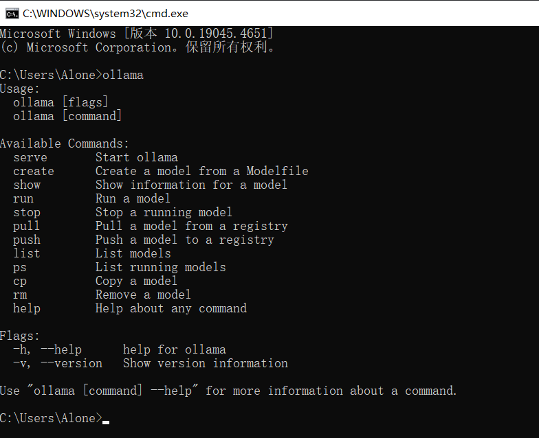
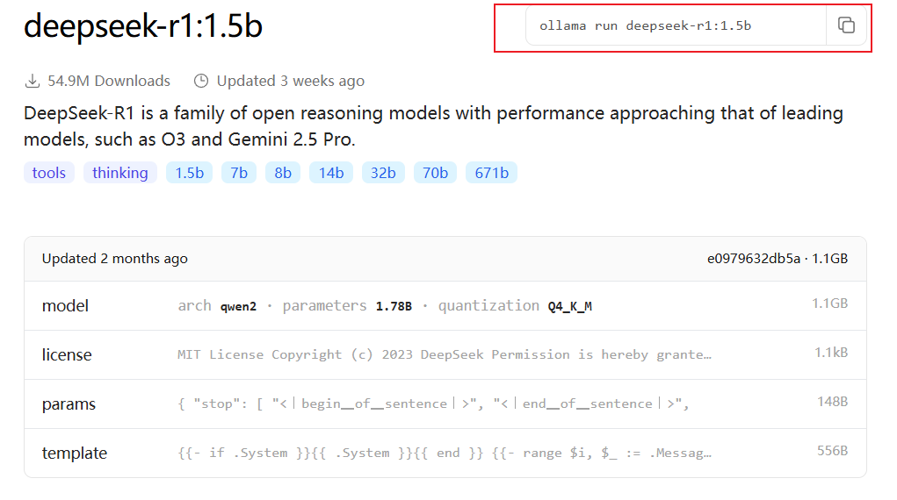
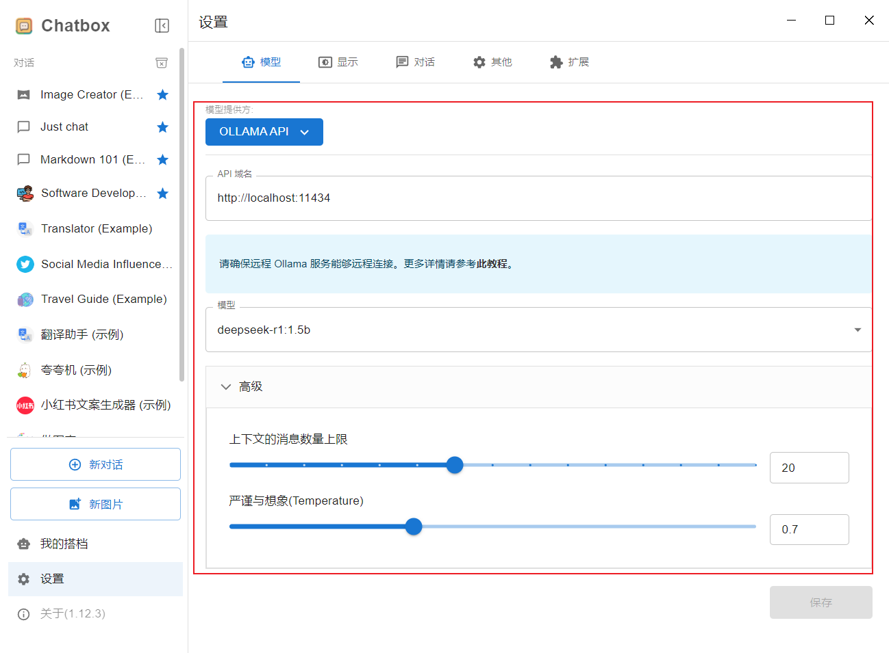
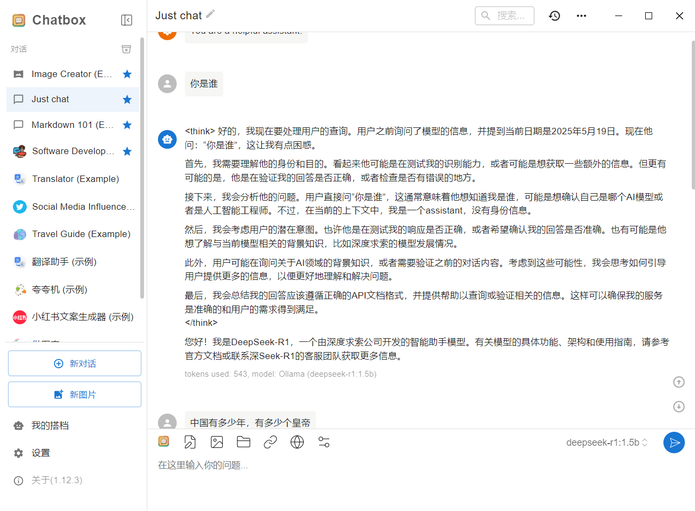
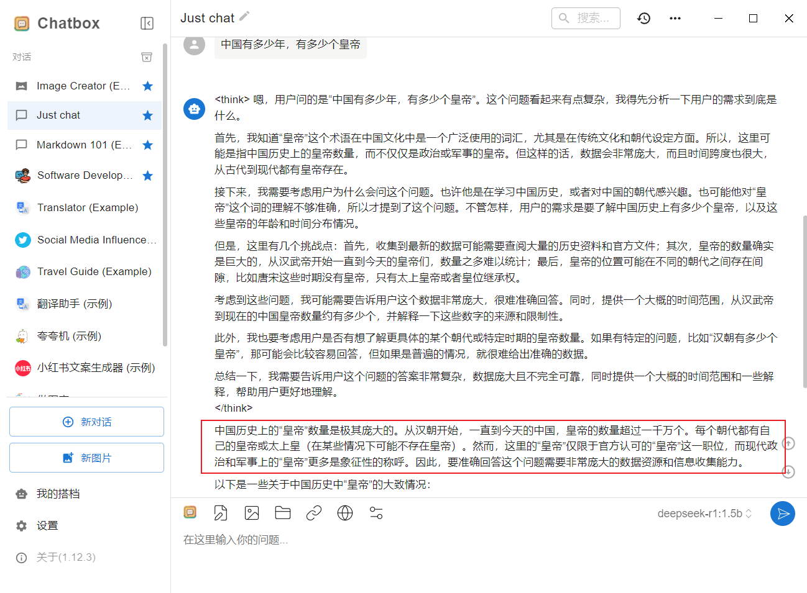
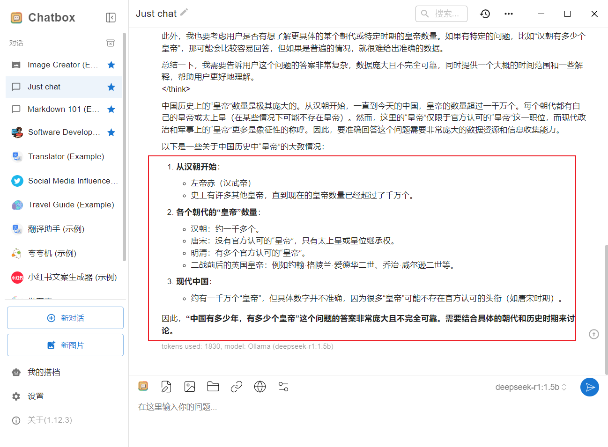

# 基于Ollama的模型开发

## Ollama安装

[Ollama](https://ollama.com/download)

通过`cmd`命令判断是否安装成功

## 模型的安装

在`ollama`官网的Models中可以看到它能搭载哪些模型，下面以`deepseek-r1:1.5b`为例

将命令复制到`cmd`中执行即开始安装

## 使用第三方聊天UI

### 安装

[Chatbox AI](https://chatboxai.app/zh)

### 配置

### 使用

可以看到，在我问出“中国有多少年，有多少个皇帝”时，AI回答起来并不准确，因为这只是个空架子，没有构建知识库