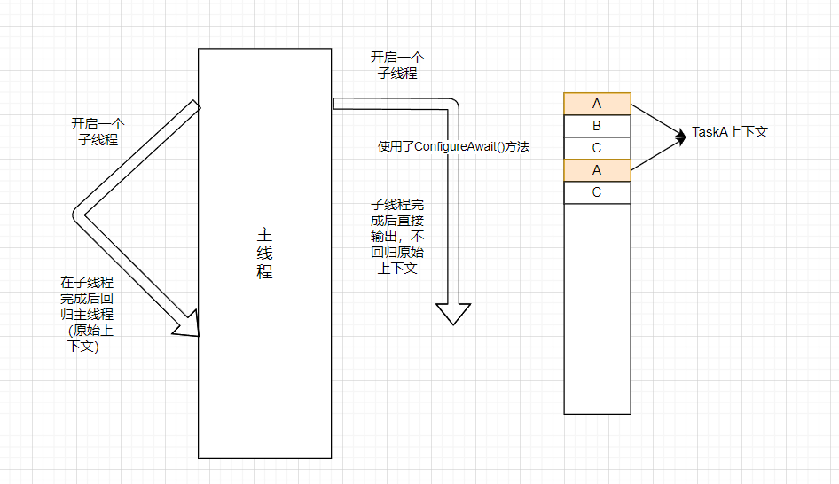

# 多线程

## 进程和线程

**进程：**进程是程序的基本执行实体，即一个程序启动就是一个进程

**线程：**线程是操作系统能够进行运算调度的最小单位。一个程序可以启动多个线程，通过不同线程运行不同的任务

> **CPU：**每台电脑至少有一个CPU，现代的CPU都支持多线程，使一个CPU能表现多个虚拟CPU
>
> 注意：线程太多，切换线程的开销就会比较大，每次切换线程都要切换相应任务的上下文，进一步降低了CPU的性能，大量时间花在切换线程和上下文上面，导致真正执行任务的时间变少



## 多线程的缺点

> 多线程运行起来既复杂又困难，在单线程中不存在的一些问题，在多线程中都可能会出现

1. 缺乏原子性
2. 竞态条件
3. 复杂的内存模型及死锁

### 原子性和竞态条件

任务在单线程环境下，要么执行完成，要么正在执行，不可能说任务只是处在部分完成的情况下。但在多线程环境下，就很有可能出现只完成了部分，另一个任务又来执行相同的事情（例如银行取款）。造成这种情况的原因是多线程的**竞态条件**，竞态条件造成了不确定性。

包含竞态条件的代码，其行为取决于上下文的切换时机，这也就造成了程序执行的不确定性，一个线程中的指令相对于另一个线程中的指令是未知的。

### 死锁

|       线程A       |       线程B       |
| :---------------: | :---------------: |
|  获取线程A上的锁  |  获取线程B上的锁  |
|  请求线程B上的锁  |  请求线程A上的锁  |
| 死锁，等待B锁释放 | 死锁，等待A锁释放 |

模拟死锁我们就要理解线程任务的等待：WhenAll和WaitAll

**WaitAll**

* 没有返回值
* 同步等待，会阻塞线程直到任务完成
* 如果内部有异常，他会在WaitAll处抛出，异常收集在AggregateException中

**WhenAll**

* 返回值类型是一个表示所有任务都完成的任务（`Task` `Task<Result>`）
* 异步等待，可以使用`await`关键字，不阻塞线程
* 如果内部有异常，他会在等待的任务上抛出，异常收集在AggregateException中

#### 线程锁

关键字：lock(锁对象)

> 注意：lock线程锁只能锁线程，对多线程有效，而不能阻止主线程如何调用其他子线程

#### 线程休眠

* Thread.Sleep(1)
* Task.Delay(1)

这两个方法都是可以实现线程休眠，区别是`Thread.Sleep`只是让当前线程休眠，不释放任务，而`Task.Delay`会在线程上释放当前任务。具体来说，`Thread.Sleep`是会阻塞线程的，在休眠时间内该线程无法执行其他工作，`Task.Delay`相反。那么可以知道，`Thread.Sleep`是同步的，而`Task.Delay`是异步的

## 顺序执行线程

方法一：

```c#
var taskA = Task.Run(() =>
{
    for (int i = 0; i < 100; i++)
    {
        Console.WriteLine($"TaskA:{i}");
        Thread.Sleep(100);
    }
});
var taskAWhenAll = Task.WhenAll(taskA);
taskAWhenAll.Wait();
var taskB = Task.Run(() =>
{
    for (int i = 0; i < 120; i++)
    {
        Console.WriteLine($"TaskB:{i}");
        Thread.Sleep(100);
    }
});
var taskBWhell = Task.WhenAll(taskB);
taskBWhell.Wait();
```

方法二：

```c#
var taskA = Task.Run(() =>
{
    for (int i = 0; i < 100; i++)
    {
        Console.WriteLine($"TaskA:{i}");
        Thread.Sleep(100);
    }
});
var continueWithTaskA = taskA.ContinueWith(t =>
{
    for (int i = 0; i < 120; i++)
    {
        Console.WriteLine($"TaskB:{i}");
        Thread.Sleep(100);
    }
});
continueWithTaskA.Wait();
```

## 任务取消

我们要在任务定义时打入一个间谍，当我们需要取消任务时，就调用这个间谍，或破坏任务，或在任务内部强制抛出异常来结束任务

```c#
var taskA = Task.Run(() =>
{
    //throw new Exception("");
    for (int i = 0; i < 100; i++)
    {
        Console.WriteLine($"TaskA:{i}");
        Thread.Sleep(100);
        if (cts.Token.IsCancellationRequested)
        {
            Console.WriteLine("间谍已收到了停止执行任务的请求");
            cts.Token.ThrowIfCancellationRequested();
        }
    }
}, cts.Token);
var completionContinueTaskA = taskA.ContinueWith(t =>
{
    Console.WriteLine("任务执行完成");
}, TaskContinuationOptions.OnlyOnRanToCompletion);
var faultedContinueTaskA = taskA.ContinueWith(t =>
{
    Console.WriteLine("任务执行失败");
}, TaskContinuationOptions.OnlyOnFaulted);
var canceledContinueTaskA = taskA.ContinueWith(t =>
{
    Console.WriteLine("任务被取消");
}, TaskContinuationOptions.OnlyOnCanceled);
cts.Cancel();
try
{
    taskA.Wait();
}
catch (Exception)
{
}
```

