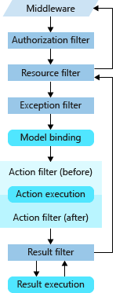

# WebApi

## 1. 三种返回值类型

- **特定类型**：是由自己指定的返回值
- **IActionResult**：返回状态码
- **ActionResult**：既返回状态码，又返回数据

## 2. Minimal APIs

最小API包括

* 新的承载API

* WebApplication和WebApplicationBuilder

* 新的路由API

  ```c#
  var builder = WebApplication.CreateBuilder(args);
  var app = builder.Builder();
  
  app.MapGet("/", () => "Hello World!");
  app.Run();
  ```
  
  ```c#
  var app = WebApplication.CreateBuilder(args);
  
  app.MapGet("/", () => "This is a Get");
  app.MapPost("/", () => "This is a Post");
  app.MapPut("/", () => "This is a Put");
  app.MapDelete("/", () => "This is a Delete");
  
  app.Run();
  ```
  
  静态方法
  
  ```c#
  var builder = WebApplication.CreateBuilder(args);
  var app = builder.Builder();
  
  app.MapGet("/", () => "Hello World!");
  
  string Hi()=> "Hello .NET";
  app.MapGet("/hello", Hi);
  
  app.MapGet("user/{userName}/age/{age}"),
  	(int userName, int age) => $"{userName}今年{age}岁";
  
  app.Run();
  
  class HelloWorld
  {
      public static string Hello()
      {
          return "Hello World";
      }
  }
  ```
  
  路由约束：路由约束限制路由的匹配行为
  
  ```c#
  var builder = WebApplication.CreateBuilder(args);
  var app = builder.Builder();
  
  app.MapGet("/todos/{text}", (string text) => text);
  app.MapGet("/posts/{slug:regex(^[a-z0-9_-]+$)}", (string slug) => $"Post{slug}");
  
  app.Run();
  ```
  
  

## 3. 依赖注入

### 3.1 理解IOC

IOC即控制反转，是让本来要去new的服务主动引用进来的一种思想

依赖注入是实现控制反转的一种方式

### 3.2 依赖注入的概念

DI即依赖注入，我们首先要理清**谁依赖谁，为什么需要依赖注入，谁注入谁，注入了什么**

- 谁依赖谁：当然是应用程序依赖IOC容器
- 为什么需要依赖注入：应用程序需要IOC容器来提供对象需要的外部资源
- 谁注入了谁：很明显是IOC容器注入应用程序某个对象，应用程序依赖的对象
- 注入了什么：就是注入某个对象所需要的外部资源（包括对象、资源、常量数据）

### 3.3 服务生命周期

- **Transient(瞬态)**
- **Scoped(作用域)**
- **Singleton(单例)**

### 3.4 三种常用的注入方式

- **构造注入（原生容器只能以这种方式注入）**
- **属性注入**
- **方法注入**

> 注入有泛型注入和typeof两种，但typeof可以注入带有泛型的类

### 3.5 Autofac

#### 3.5.1 Autofac的基础用法

- **可以实现属性注入**
- **安装NuGet包：`Autofac.Extensions.DependencyInjection`**
- **在Program.cs配置文件中注册服务**

```C#
builder.Host.UseServiceProviderFactory(new AutofacServiceProviderFactory());
builder.Host.ConfigureContainer<ContainerBuilder>(builder =>
{
    //AutofacExtensions是一个扩展类中的方法
    //如果将将所有的注入都写在配置文件中，会使配置文件很多，难以阅读
    builder.AutofacExtensions();
});
```

```c#
public static class ServiceExtensions
{
    public static void AutofacExtensions(this ContainerBuilder builder)
    {
        builder.RegisterGeneric(typeof(BaseService<>)).As(typeof(IBaseService<>));
        builder.RegisterType<UserService>().As<IUserService>().SingleInstance();//单例
        //作用域
        //PropertiesAutowired是允许属性注入
        //这个的意思不是允许IocService去注入别人，而是允许别人对它进行属性注入
        builder.RegisterType<IocService>().As<IIocService>().InstancePerLifetimeScoped()
            .PropertiesAutowired();
    }
}
```

> 注意：使用Autofac对控制器实现属性注入是没法成功的，因为控制器不是通过容器创建的，而是通过反射的方式生成的。这时，我们就需要对控制器的服务进行修改，将**`builder.Services.AddControllers();`**修改成**`builder.Services.AddControllers().AddControllersAsServices();`**这样我们就是以服务的方式生成Controller，控制器就是以容器生成了。

### 3.5.2 Autofac模块化

Autofac模块化让一些方法自动生成不需要在手写

```C#
public class ApiModule : Autofac.Module
{
    protected override void Load(ContainerBuilder builder)
    {
        builder.RegisterType<IocService>().As<IIocService>()
        .InstancePerLifetimeScoped()
        .PropertiesAutowired();
    }
}
```

```C#
builder.Host.UseServiceProviderFactory(new AutofacServiceProviderFactory());
builder.Host.ConfigureContainer<ContainerBuilder>(builder =>
{
    //builder.AutofacExtensions();
    builder.RegisterModule<ApiModule>();
});
```

## 4. Filter过滤器

###4.1 理解AOP

AOP即面向切面编程。一个方法只应该承担与其业务相关的事情，不宜承担其他业务逻辑。如果有其他前置的业务逻辑存在，我们应该在进入该方法之前执行前置业务逻辑。这就好比在进入这个方法之前横切一刀，插入前置业务逻辑，所以叫做面向切面编程

Filter就是实现AOP的一种方式

### 4.2 Filter的类型

- **AuthorizationFilter    授权过滤器**
- **IResourceFilter        资源管理过滤器**
- **IActionFilter          行为过滤器**
- **IExceptionFilter       异常过滤器**
- **IResultFilter          结果过滤器**

### 4.3 执行顺序



### 4.4 三种注册方式

- **方法注册**
- **类注册**
- **全局注册**

全局注册是在`Program.cs`文件中，在`builder.Services.AddController();`中使用

```C#
builder.Services.AddController(0=>{
    //CtmActionFilterAttribute是自己定义的类
    //后面的数字是优先级，数字越小，优先级越高
    o.Filters.Add<CtmActionFilter2Attribute>(1);
    o.Filters.Add<CtmActionFilterAttribute>(2);
});
```

### 4.6 Filter依赖注入

与上述的依赖注入方式相同，但要将Filter的注册进行修改使用`[TypeFilter(typeof(CtmActionFilterAttribute))]`

### ResourceFilter使用场景

```C#
//这两个是注册缓存，随便用哪个都行
builder.Services.AddSingleton<IMemoryCache,MemoryCache>();
// builder.Services.AddSingleton<IDistributedCache,MemoryDistributedCache>();
```

```C#
namespace AopDemo.Api.Controllers
{
    [ApiController]
    [Route("api/[controller]")]
    [TypeFilter(typeof(CtmResourceFilterAttribute))]
    public class TestController: ControllerBase
    {
        [HttpGet]
        public string Test()
        {
            return "test";
        }
    }
}
```

```C#
namespace AopDemo.Api.Filters
{
    public class CtmResourceFilterAttribute : Attribute, IResourceFilter
    {
        private readonly IMemoryCache _cache;

        public CtmResourceFilterAttribute(IMemoryCache cache)
        {
            this._cache = cache;
        }
        public void OnResourceExecuted(ResourceExecutedContext context)
        {
            var path = context.HttpContext.Request.Path.ToString();
            if (context.Result != null)
            {
                var value = (context.Result as ObjectResult).Value.ToString();
                _cache.Set(path, value,TimeSpan.FromDays(1));
            }
        }

        public void OnResourceExecuting(ResourceExecutingContext context)
        {
            var path = context.HttpContext.Request.Path.ToString();
            var hasValue = _cache.TryGetValue(path, out object value);
            if (hasValue)
            {
                context.Result = new ContentResult
                {
                    Content = value.ToString()
                };
            }
        }
    }
}
```

### ActionFilter使用场景

- 模型验证
- 记录日志

```C#
namespace AopDemo.Api.Controllers
{
    [ApiController]
    [Route("api/[controller]")]
    [TypeFilter(typeof(CtmResourceFilterAttribute))]
    [CtmActionFilter]
    public class TestController: ControllerBase
    {
        [HttpGet]
        public string Test(string? id)
        {
            return "test";
        }
    }
}
```

```C#
namespace AopDemo.Api.Filters
{
    public class CtmActionFilterAttribute : Attribute, IActionFilter
    {
        public void OnActionExecuted(ActionExecutedContext context)
        {
        }

        public void OnActionExecuting(ActionExecutingContext context)
        {
            var logger = context.HttpContext.RequestServices.GetService<ILogger<CtmActionFilterAttribute>>();
            var path=context.HttpContext.Request.Path;
            var controller=context.RouteData.Values["controller"];
            var action = context.RouteData.Values["action"];
            //使用每个元素之间的指定分隔符连接字符串数组的所有元素
            var arguments =string.Join(",",context.ActionArguments);
            logger.LogInformation($"访问的路由：{path}，控制器是{controller}，行为是{action}，参数是{arguments}");
        }
    }
}
```


### ExceptionFilter作用域

**ExceptionFilter**只能作用于**ActionFilter**和**Controller**

```C#
namespace AopDemo.Api.Filters
{
    public class CtmAuthorizationFilterAttribute : Attribute, IAuthorizationFilter
    {
        public void OnAuthorization(AuthorizationFilterContext context)
        {
            throw new Exception("OnAuthorization");
        }
    }
}
```

```C#
namespace AopDemo.Api.Filters
{
    public class CtmResourceFilterAttribute : Attribute, IResourceFilter
    {
        public void OnResourceExecuted(ResourceExecutedContext context)
        {
            throw new Exception("OnResourceExecuted");
        }

        public void OnResourceExecuting(ResourceExecutingContext context)
        {
            throw new Exception("OnResourceExecuting");
        }
    }
}
```

```C#
namespace AopDemo.Api.Filters
{
    public class CtmActionFilterAttribute : Attribute, IActionFilter
    {
        public void OnActionExecuted(ActionExecutedContext context)
        {
            throw new Exception("OnActionExecuted");
        }

        public void OnActionExecuting(ActionExecutingContext context)
        {
            throw new Exception("OnActionExecuting");
        }
    }
}
```

```C#
namespace AopDemo.Api.Controllers
{
    [ApiController]
    [Route("api/[controller]")]
    [TypeFilter(typeof(CtmResourceFilterAttribute))]
    [CtmActionFilter]
    [CtmAuthorizationFilter]
    [CtmExceptionFilter]
    public class TestController : ControllerBase
    {
        [HttpGet]
        public string Test(string? id)
        {
            throw new Exception("TestController");
        }
    }
}
```

```C#
namespace AopDemo.Api.Filters
{
    public class CtmExceptionFilterAttribute : Attribute, IExceptionFilter
    {
        public void OnException(ExceptionContext context)
        {
            throw new NotImplementedException();
        }
    }
}
```

通过断点测试可以知道这样的结果：

- 在进入**AuthorizationFilter**后继续执行没有进入**ExceptionFilter**
- 在进入**ResourceFilter**后继续执行没有进入**ExceptionFilter**
- 在进入**ActionFilter**后继续执行进入了**ExceptionFilter**
- 在进入**Controller**后继续执行进入了**ExceptionFilter**

## 5. 中间件

### 5.1 中间件顺序


执行到`Endpoint`中间件时，程序才会进入过滤器的管道

### 5.2 中间件的使用和运行规则

中间件每一次请求就会运行一次，启动项目时会有一次请求，在中间件上打断点会被截停一次，进入swagger后请求接口又是一次请求，中间件再次截停。

```C#
var builder = WebApplication.CreateBuilder(args);

builder.Services.AddControllers();
// Add services to the container.
// Learn more about configuring Swagger/OpenAPI at https://aka.ms/aspnetcore/swashbuckle
builder.Services.AddEndpointsApiExplorer();
builder.Services.AddSwaggerGen();

var app = builder.Build();

// Configure the HTTP request pipeline.
if (app.Environment.IsDevelopment())
{
    app.UseSwagger();
    app.UseSwaggerUI();
}

app.UseHttpsRedirection();
app.UseAuthorization();
app.Use(async (context, next) =>
{
    if (context.Request.Path == "/api/test")
    {
        context.Response.StatusCode = 500;
    }
    else
    {
        await next();
    }
});

app.MapControllers();

app.Run();
```

```C#
namespace MiddlewareDemo.Api.Middlewares
{
    public static class MiddlewareExtensions
    {
        public static void UseTest(this IApplicationBuilder app)
        {
            app.Use(async (context, next) =>
            {
                if (context.Request.Path == "/api/test")
                {
                    context.Response.StatusCode = 500;
                }
                else
                {
                    await next();
                }
            });
        }
    }
}
```

```C#
using MiddlewareDemo.Api.Middlewares;

var builder = WebApplication.CreateBuilder(args);

builder.Services.AddControllers();
// Add services to the container.
// Learn more about configuring Swagger/OpenAPI at https://aka.ms/aspnetcore/swashbuckle
builder.Services.AddEndpointsApiExplorer();
builder.Services.AddSwaggerGen();

var app = builder.Build();

// Configure the HTTP request pipeline.
if (app.Environment.IsDevelopment())
{
    app.UseSwagger();
    app.UseSwaggerUI();
}

app.UseHttpsRedirection();
app.UseAuthorization();
app.UseTest();

app.MapControllers();

app.Run();
```

### 5.3 异常处理中间件的用法

**方法一：**

```C#
using Microsoft.AspNetCore.Diagnostics;

var builder = WebApplication.CreateBuilder(args);

builder.Services.AddControllers();
// Add services to the container.
// Learn more about configuring Swagger/OpenAPI at https://aka.ms/aspnetcore/swashbuckle
builder.Services.AddEndpointsApiExplorer();
builder.Services.AddSwaggerGen();

var app = builder.Build();

//方法一
app.UseExceptionHandler(configure =>
{
//这里的Run和最下面的Run不是同一个方法
    configure.Run(async context =>
    {
        var exHandler = context.Features.Get<IExceptionHandlerPathFeature>();
        var ex = exHandler.Error;
        if (ex != null)
        {
            context.Response.ContentType = "text/plain;charset=utf-8";
            await context.Response.WriteAsync(ex.ToString());
        }
    });
});

// Configure the HTTP request pipeline.
if (app.Environment.IsDevelopment())
{
    app.UseSwagger();
    app.UseSwaggerUI();
}

app.UseHttpsRedirection();
app.UseAuthorization();


app.MapControllers();

app.Run();
```

**方法二：**

```C#
using Microsoft.AspNetCore.Diagnostics;

var builder = WebApplication.CreateBuilder(args);

builder.Services.AddControllers();
// Add services to the container.
// Learn more about configuring Swagger/OpenAPI at https://aka.ms/aspnetcore/swashbuckle
builder.Services.AddEndpointsApiExplorer();
builder.Services.AddSwaggerGen();

var app = builder.Build();

//方法二
app.UseExceptionHandler(new ExceptionHandlerOptions
{
    ExceptionHandler = async context =>
    {
        var exHandler = context.Features.Get<IExceptionHandlerPathFeature>();
        var ex = exHandler.Error;
        if (ex != null)
        {
            context.Response.ContentType = "text/plain;charset=utf-8";
            await context.Response.WriteAsync(ex.ToString());
        }
    }
});

// Configure the HTTP request pipeline.
if (app.Environment.IsDevelopment())
{
    app.UseSwagger();
    app.UseSwaggerUI();
}

app.UseHttpsRedirection();
app.UseAuthorization();

app.MapControllers();

app.Run();
```

**方法三：**

这个方法不再是每次都给定一个错误的信息，而是将其统一转到一个接口做处理

```C#
var builder = WebApplication.CreateBuilder(args);

builder.Services.AddControllers();
// Add services to the container.
// Learn more about configuring Swagger/OpenAPI at https://aka.ms/aspnetcore/swashbuckle
builder.Services.AddEndpointsApiExplorer();
builder.Services.AddSwaggerGen();

var app = builder.Build();

//方法三
app.UseExceptionHandler(new ExceptionHandlerOptions
{
    ExceptionHandlingPath = new PathString("/error")
});

// Configure the HTTP request pipeline.
if (app.Environment.IsDevelopment())
{
    app.UseSwagger();
    app.UseSwaggerUI();
}

app.UseHttpsRedirection();
app.UseAuthorization();

app.MapGet("/error", () =>
{
    return "error";
});

app.MapControllers();

app.Run();
```

## 6. 鉴权和授权

### 6.1 鉴权和授权的关系

**鉴权**：主要是看我有没有令牌可以进这道门

**授权**：进了这道门，我可以做什么事情

二者其实有上下游的关系，但是在业务上又没有觉得联系

### 6.2 Session的原理


### 6.3 Cookie的写入验证

`builder.Services.AddAuthentication("Cookies")`注册鉴权服务，使用Cookie的认证方式。`AddCookie`中配置Cookie身份验证的设置，`o.LoginPath = "/api/Login`指定用户未登录时应被重定向到的路径，我这里使用的RESTful风格，那么就是被定位到NoLogin方法了。

```C#
using Microsoft.AspNetCore.Authentication.Cookies;

var builder = WebApplication.CreateBuilder(args);

builder.Services.AddControllers();
// Add services to the container.
// Learn more about configuring Swagger/OpenAPI at https://aka.ms/aspnetcore/swashbuckle
builder.Services.AddEndpointsApiExplorer();
builder.Services.AddSwaggerGen();

//注册鉴权架构
#region Cookie
// builder.Services.AddAuthentication(CookieAuthenticationDefaults.AuthenticationScheme);
builder.Services.AddAuthentication("Cookies").AddCookie(o =>
{
    o.LoginPath = "/api/Login";
});
#endregion

var app = builder.Build();

// Configure the HTTP request pipeline.
if (app.Environment.IsDevelopment())
{
    app.UseSwagger();
    app.UseSwaggerUI();
}

app.UseHttpsRedirection();

app.UseAuthentication();//鉴权

app.UseAuthorization();//授权

app.MapControllers();

app.Run();
```

```C#
namespace AuthDemo.Api.Controllers
{
    [ApiController]
    [Route("api/[controller]")]
    [Authorize]
    public class TestController : ControllerBase
    {
        [HttpGet]
        public string Test()
        {
            return "test";
        }
    }
}
```

```C#
namespace AuthDemo.Api.Controllers
{
    [ApiController]
    [Route("api/[controller]")]
    public class LoginController : ControllerBase
    {
        [HttpGet]
        public async Task<string> NoLogin()
        {
            return "你还没有登录";
        }

        [HttpGet("{userName}")]
        public async Task<string> LoginSuccess(string userName,string password)
        {
            if(userName=="Ace"&&password=="666")
            {
                ClaimsIdentity claimsIdentity=new("Ctm");
                claimsIdentity.AddClaim(new Claim(ClaimTypes.Name,userName));
                claimsIdentity.AddClaim(new Claim(ClaimTypes.NameIdentifier,"1"));
                await HttpContext.SignInAsync("Cookies",new ClaimsPrincipal(claimsIdentity));
                return "登录成功";
            }
            return "登录失败";
        }
    }
}
```

当未登录时，调用`Test`将返回“你还没有登录”的提示信息。登录当登录成功后，将我们指定的信息写入Cookie中，再次调用`Test`返回“test”


### 6.4 自定义token鉴权

`builder.Services.AddAuthentication`注册鉴权服务，`option` 是一个配置对象，用于设置身份验证选项

`option.AddScheme<TokenAuthenticationHandler>("token", "ctmToken")`添加了一个自定义的鉴权方案，`TokenAuthenticationHandler`是一个处理自定义鉴权的类，`token`是这个鉴权方案的名称用于标识，`ctmToken`是一个显示名称（或描述），在某些地方可能用于日志记录或调试

`option.DefaultAuthenticateScheme = "token"`将 `"token"` 设置为默认的鉴权方案

`option.DefaultChallengeScheme = "token"`用户未登录时使用的方案

`option.DefaultForbidScheme = "token"`没有权限时使用的方案

```C#
using AuthDemo.Api.CtmAuthentication;
using Microsoft.AspNetCore.Authentication.Cookies;

var builder = WebApplication.CreateBuilder(args);

builder.Services.AddControllers();
// Add services to the container.
// Learn more about configuring Swagger/OpenAPI at https://aka.ms/aspnetcore/swashbuckle
builder.Services.AddEndpointsApiExplorer();
builder.Services.AddSwaggerGen();

#region 自定义token验证
builder.Services.AddAuthentication(option =>
{
    //把自定义的鉴权方案添加到鉴权架构中
    option.AddScheme<TokenAuthenticationHandler>("token", "ctmToken");
    option.DefaultAuthenticateScheme = "token";
    option.DefaultChallengeScheme = "token";
    option.DefaultForbidScheme = "token";
});
#endregion

var app = builder.Build();

// Configure the HTTP request pipeline.
if (app.Environment.IsDevelopment())
{
    app.UseSwagger();
    app.UseSwaggerUI();
}

app.UseHttpsRedirection();

app.UseAuthentication();

app.UseAuthorization();

app.MapControllers();

app.Run();
```

```C#
namespace AuthDemo.Api.CtmAuthentication
{
    public class TokenAuthenticationHandler : IAuthenticationHandler
    {
        private AuthenticationScheme _scheme;
        private HttpContext _context;

        /// <summary>
        /// 鉴权初始化
        /// </summary>
        /// <param name="scheme">鉴权架构名称</param>
        /// <param name="context">HttpContext</param>
        /// <returns></returns>
        public async Task InitializeAsync(AuthenticationScheme scheme, HttpContext context)
        {
            _scheme = scheme;
            _context = context;
        }

        /// <summary>
        /// 鉴权
        /// </summary>
        /// <returns></returns>
        public Task<AuthenticateResult> AuthenticateAsync()
        {
            //从HTTP请求的Authorization头中提取出令牌。这个令牌通常用于验证用户身份。
            string token = _context.Request.Headers["Authorization"];
            if (token == "Ace")
            {
                //如果Token验证成功，创建一个ClaimsIdentity对象来表示用户的身份，"Ctm"是身份验证方案的名称
                ClaimsIdentity claimsIdentity = new("Ctm");
                //使用 ClaimsIdentity.AddClaims 添加了一组声明（Claim），这些声明包含了用户的信息
                claimsIdentity.AddClaims(new List<Claim>{
                    new Claim(ClaimTypes.Name,"Ace"),
                    new Claim(ClaimTypes.NameIdentifier,"6")
                });
                //使用ClaimsIdentity创建一个ClaimsPrincipal对象，它代表经过身份验证的用户。
                var claimsPrincipal = new ClaimsPrincipal(claimsIdentity);
                return Task.FromResult(AuthenticateResult.Success(new AuthenticationTicket(claimsPrincipal, null, _scheme.Name)));
            }
            return Task.FromResult(AuthenticateResult.Fail($"token错误，请重新登录"));
        }

        /// <summary>
        /// 未登录
        /// </summary>
        /// <param name="properties"></param>
        /// <returns></returns>
        public async Task ChallengeAsync(AuthenticationProperties? properties)
        {
            _context.Response.Redirect("/api/Login");
        }

        /// <summary>
        /// 没有权限访问
        /// </summary>
        /// <param name="properties"></param>
        /// <returns></returns>
        public async Task ForbidAsync(AuthenticationProperties? properties)
        {
            _context.Response.StatusCode = 403;
        }
    }
}
```


## 7. EFCore

### 7.1 Linq的用法

```C#
#region Linq
string[] arr = { "ace", "sdws", "ccaa", "djsklu", "dfibk", "ytwa" };
var res = from i in arr where i.Contains("a") orderby i select i;
foreach (var item in res) System.Console.WriteLine(item);
#endregion
```


### 7.2 延迟执行和立即执行

```C#
#region 延迟查询
int[] nums={1,2,3,4,5,6};
var res =from i in nums where i>3 select i;
//IEnumerable具有一个延迟加载的功能，系统不是在上一句中计算的，而是真正用到时才会计算
foreach(var item in res) System.Console.WriteLine(item);
System.Console.WriteLine("--------------------------");
//当修改了数组中某一个数据，再次调用foreach则又会做一次linq运算
nums[0]=9;
//如果res的值是已经算好的，那么这次输出的值应该与上一次相同
foreach(var item in res) System.Console.WriteLine(item);
#endregion
```


```C#
#region 立即执行
int[] nums={1,2,3,4,5,6};
var res =(from i in nums where i>3 select i).ToList();
foreach(var item in res) System.Console.WriteLine(item);
System.Console.WriteLine("--------------------------");
nums[0]=9;
foreach(var item in res) System.Console.WriteLine(item);
#endregion
```


### 7.3 Cast和OfType

```C#
#region Cast
using System.Collections;
//Cast只会把非泛型序列转换为泛型序列，如果包含与转换元素不同的类型，此时系统会报错
ArrayList arrayList = new(){1,2,3,4,5,6};
var res = arrayList.Cast<int>();
foreach(int item in res) System.Console.WriteLine(item);
#endregion
```

```C#
#region OfType
using System.Collections;
//Cast只会把非泛型序列转换为泛型序列，并剔除不相干的类型
ArrayList arrayList = new() { 1, 2, 3, 4, 5, 6, "ace" };
var res = arrayList.OfType<int>();
foreach (int item in res) System.Console.WriteLine(item);
#endregion
```


