# RBAC权限验证管理

## 1. 项目前期准备

### 1.1. 数据库设计图

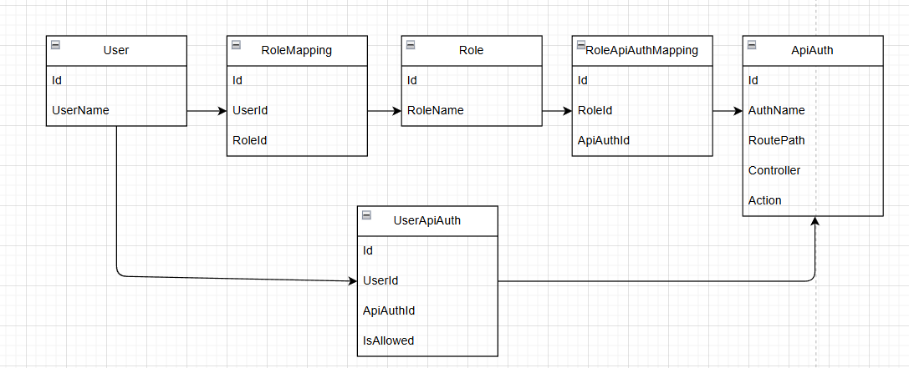

[RBAC分析](drawio\RBAC.drawio.png)

### 1.2. 技术选型

**.NET版本：**.NET 9

**框架：**AceFramework

## 2. 第一步

设计`User`、`Role`、`UserRoleMapping`实体，领域服务逻辑是在获取用户信息同时获取该用户的角色信息，应用层服务就是调用获取用户信息的服务以及获取所有服务和接口的信息

### 2.1. 实体设计

**User实体**

```c#
public class User : BaseModel<long>
{
    public string UserName { get; set; }
    [NotMapped]
    public List<Role> Roles { get; set; }
}
```

**Role实体**

```c#
public class Role : BaseModel<long>
{
    public string RoleName { get; set; }
}
```

**UserRoleMapping实体**

```c#
public class UserRoleMapping : BaseModel<long>
{
    public long UserId { get; set; }
    public long RoleId { get; set; }
}
```

### 2.2. 领域服务设计

**UserManager**

```c#
public class UserManager(
    IRepository<User> userRepository,
    IRepository<Role> roleRepository) : DomainServicer
{
    public async Task<List<User>> GetUserAsync(params long[] ids)
    {
        var users = await userRepository.GetListAsync(m => ids.Contains(m.Id));
        users = await roleRepository.WithJoinAsync<UserRoleMapping, User>(
            users,
            m => m.Roles
        );
        return users;
    }
}
```


> `WithJoinAsync`是AceFramework框架中多对多的获取方法
>
> // 第一个泛型参数是中间映射实体类型
> // 第二个泛型参数是源数据实体类型
> // 第一个参数是源数据，即用户信息
> // 第二个参数即用户实体中关联存放角色表的属性

在`User` 表中查询出与传入`id`相等的用户，通过`WithJoinAsync` 方法获取该用户信息以及与其关联角色的信息

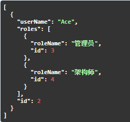

### 2.3. 应用层服务

**UserService**

```c#
public class UserService(
    UserManager userManager,
    IAceApiRouteDescriptor aceApiRouteDescriptor) : AbilityServicer
{
    public async Task<List<User>> GetUsersAsync(params long[] ids)
    {
        return await userManager.GetUserAsync(ids);
    }

    public async Task<List<ApiRouteDescriptionModel>> GetApiRoutesAsync()
    {
        return aceApiRouteDescriptor.GetApiRouteDescriptions();
    }
}
```

> `GetApiRouteDescriptions`方法是AceFramework框架中的路由获取功能
>
> `ApiRouteDescriptionModel`信息如下：
>
>  "groupName": null,
>  "areaName": null,
>  "controllerFullName": "Youshow.Demo.NewApi.Controllers.APIRouterController",
>  "controllerName": "APIRouter",
>  "actionName": "GetInfo",
>  "actionDescription": "获取路由信息",
>  "method": "GET",
>  "RoutePath": "APIRouter/GetInfo",
>  "parameters": [],
>  "fullName": "Youshow.Demo.NewApi.Controllers.APIRouterController.GetInfo()"
>
> WebAPI项目的`.csproj`文件中加入`<GenerateDocumentationFile>true</GenerateDocumentationFile>` 才能读取注释信息

### 2.4. 控制层

**BaseController**

```c#
[Area("user")]
[ApiController]
[Route("[area]/[controller]")]
public class BaseController : ControllerBase
{   
}
```

**NewApiController**

```c#
public class NewApiController : BaseController
{
    /// <summary>
    /// 获取用户姓名
    /// </summary>
    /// <param name="userName"></param>
    /// <returns></returns>
    [HttpGet]
    public async Task<string> GetUserName(string userName)
    {
        return userName;
    }
}
```

> `NewApiController`只是一个示例，只是为了做测试

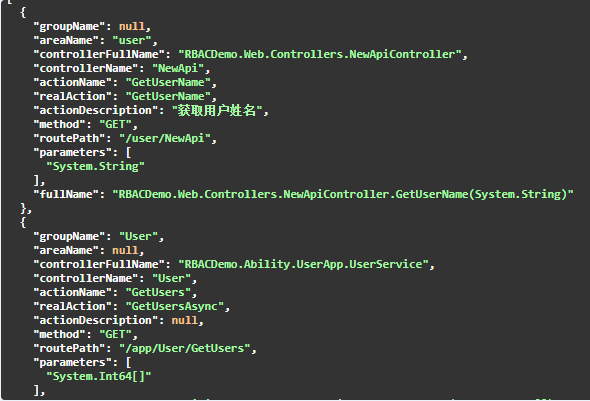

## 3. 第二步

设计`ApiAuth`实体，这是一个充血模型，领域服务逻辑是`ApiAuth`增删改的逻辑，应用层服务就是调用领域服务

### 3.1. 实体设计

**ApiAuth实体**

```c#
public class ApiAuth : BaseModel<long>
{
    public string? GroupName { get; set; }

    public string? AreaName { get; set; }

    public string ControllerName { get; set; }

    public string ActionName { get; set; }

    public string? ActionDescription { get; set; }

    public string Method { get; set; }

    public string RoutePath { get; set; }

    public ApiAuthUpdateState Update(ApiAuth newApiAuth)
    {
        if (GroupName == newApiAuth.GroupName && ActionDescription == newApiAuth.ActionDescription)
        {
            return ApiAuthUpdateState.None;
        }
        else
        {
            GroupName = newApiAuth.GroupName;
            ActionDescription = newApiAuth.ActionDescription;
            return ApiAuthUpdateState.Update;
        }
    }

    public ApiAuthUpdateState CheckAndUpdate(List<ApiAuth> newApiAuths)
    {
        var newApiAuth = newApiAuths.FirstOrDefault(m => m.RoutePath == RoutePath &&
                                                         m.Method == Method &&
                                                         m.ControllerName == ControllerName &&
                                                         m.ActionName == ActionName);
        if (newApiAuth != null)
        {
            return Update(newApiAuth);
        }
        else
        {
            return ApiAuthUpdateState.Delete;
        }
    }
}
```

1.如果项目中接口数据的`GroupName`以及`ActionDescription`与数据库中的相同就不用作任何处理，不相同就更新

2.如果项目中接口数据的`RoutePath`和`Method`和`ControllerName`以及`ActionName`与数据库中的完全相同，那么是可以判断出这两个就是同一个接口，再去执行1逻辑看是否需要更新；如果不相同，那么表中就存在错误的数据，需要删除

### 3.2. 领域服务设计

**RoleAuthManager**

```c#
public class RoleAuthManager(
    IRepository<ApiAuth> apiAuthRepository,
    IRepository<RoleApiAuthMapping> roleApiAuthMappingRepository) : DomainServicer
{
    public async Task AddApiAuthAsync(List<ApiAuth> apiAuths)
    {
        var willUpdateData = new List<ApiAuth>();
        var willDeleteData = new List<ApiAuth>();
        // 1.获取所有的ApiAuth
        var resApiAuth = await apiAuthRepository.GetListAsync();
        // 2.检测已有的数据并检测需要删除的数据
        resApiAuth.ForEach(m =>
        {
            // 通过返回值判定当前的ApiAuth是否需要删除
            var isUpdate = m.CheckAndUpdate(apiAuths);
            if (isUpdate == ApiAuthUpdateState.Delete)
            {
                willDeleteData.Add(m);
            }
            else if (isUpdate == ApiAuthUpdateState.Update)
            {
                willUpdateData.Add(m);
            }
        });

        // 3.筛选出需要添加的数据
        var resRoutePaths = resApiAuth.Select(m => m.RoutePath + "_" + m.Method);
        var willAddApiAuth = apiAuths.Where(m => !resRoutePaths.Contains(m.RoutePath + "_" + m.Method));
        // 4.实际操作
        await apiAuthRepository.UpdateManyAsync(willUpdateData);
        await apiAuthRepository.DeleteManyAsync(willDeleteData);
        await apiAuthRepository.InsertManyAsync(willAddApiAuth, false);
    }

    public async Task DeleteRoleApiAuthAsync(long roleId)
    {
        await roleApiAuthMappingRepository.DeleteAsync(m => m.RoleId == roleId);
    }
}
```

首先将`ApiAuth`表中所有的数据取出，将表中的每一条数据去与项目中应用层服务和控制层接口作校验，表中满足删除条件的数据、更新条件的数据作相应的删除或更新处理，然后将表中数据的`RoutePath` 和`Method`取出来和项目中相应的作对比，如果项目中的数据是数据库中没有的就将其添加到数据库中

### 3.3. 应用服务层

**RoleAuthService**

```c#
public class RoleAuthService(
    RoleAuthManager roleAuthManager,
    IAceApiRouteDescriptor aceApiRouteDescriptor) : AbilityServicer
{
    public async Task RefreshApiAuthAsync()
    {
        var models = aceApiRouteDescriptor.GetApiRouteDescriptions();
        var apiAuths = ModelMapper.Map<List<ApiRouteDescriptionModel>, List<ApiAuth>>(models);
        await roleAuthManager.AddApiAuthAsync(apiAuths);
    }
}
```

首先`models`是通过框架的方法获取到所有的应用层服务和控制层接口的相关路由信息，将`models`转化为`ApiAuth`表的数据格式，然后将转化好的数据传给领域服务作相应的逻辑处理

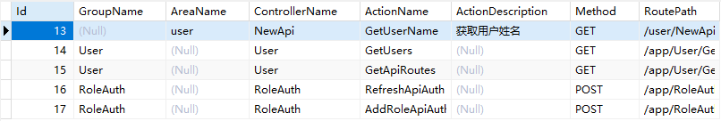

## 4. 第三步

设计`RoleApiAuthMapping`实体，领域服务逻辑是`RoleApiAuthMapping`和`UserRoleMapping`增删的逻辑，应用层服务就是调用领域服务

### 4.1. 实体设计

**RoleApiAuthMapping实体**

```c#
public class RoleApiAuthMapping : BaseModel<long>
{
    public long RoleId { get; set; }

    public long ApiAuthId { get; set; }
}
```

### 4.2. 领域服务设计

**RoleAuthManager**

```c#
    public async Task DeleteRoleApiAuthAsync(long roleId)
    {
        await roleApiAuthMappingRepository.DeleteAsync(m => m.RoleId == roleId);
    }

    public async Task AddRoleApiAuthAsync(long roleId, List<long> apiAuthIds)
    {
        List<RoleApiAuthMapping> roleApiAuthMappings = new();
        apiAuthIds.ForEach(m =>
        {
            roleApiAuthMappings.Add(new RoleApiAuthMapping()
            {
                RoleId = roleId,
                ApiAuthId = m
            });
        });
        await roleApiAuthMappingRepository.InsertManyAsync(roleApiAuthMappings, false);
    }
```

`DeleteRoleApiAuthAsync`方法是将传入的角色Id的角色权限关联表中的数据全部删除

`AddRoleApiAuthAsync`方法是将该角色新的权限加入到角色权限关联表中

**UserManager**

与上面领域服务类似

### 4.3. 应用层服务

**RoleAuthService**

```c#
    public async Task AddRoleApiAuthsAsync(long roleId, params long[] apiAuths)
    {
        await roleAuthManager.DeleteRoleApiAuthAsync(roleId);
        await roleAuthManager.AddRoleApiAuthAsync(roleId, apiAuths.ToList());
    }
```

首先将传入的角色Id的角色权限关联表中的数据全部删除，再将该角色新的权限加入到角色权限关联表中

**UserService**

与上面应用层服务类似


## 5. 第四步

替换`RoleAuthService`的继承，使用AceFramework中自带CRUD的服务，创建接口、Dto来实现`Role`的CRUD

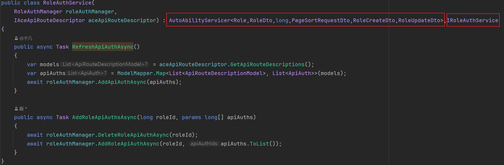

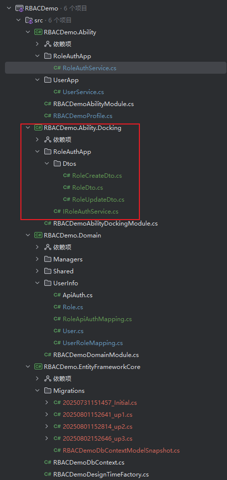

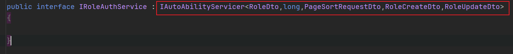

## 6. 第五步

在`Role`实体中加入`ApiAuth`属性，获取其角色信息时同时获取权限信息，这样获取用户信息的同时获取该用户的角色信息以及该用户角色下的权限信息

### 6.1. 领域服务层

**RoleAuthManager**

添加获取角色信息的同时获取其权限信息的逻辑

```c#
public async Task<List<Role>> GetApiAuthToRoleAsync(params Role[] roles)
    {
        if (roles != null && roles.Length > 0)
        {
            var resRoles = await apiAuthRepository.WithJoinAsync<RoleApiAuthMapping, Role>(
                roles.ToList(),
                m => m.ApiAuths);
            return resRoles;
        }

        throw new ArgumentNullException("roles");
    }
```

### 6.2. 应用服务层

**UserService**

修改`GetUsersAsync`方法的逻辑

```c#
public async Task<List<User>> GetUsersAsync(params long[] ids)
    {
        var resUsers = await userManager.GetUserAsync(ids);
        if (resUsers.Count == 1)
        {
            var resUser = resUsers.FirstOrDefault();
            resUser.Roles = await roleAuthManager.GetApiAuthToRoleAsync(resUser.Roles.ToArray());
        }
        else if (resUsers.Count > 1)
        {
            List<Role> rolesOfWillAddApiAuth = new();
            // 获取所有用户的所有角色
            var rolesOfUsers = resUsers.Select(m => m.Roles);
            // 把所有角色都加到rolesOfWillAddApiAuth集合中并去重
            foreach (var rolesOfUser in rolesOfUsers)
            {
                rolesOfWillAddApiAuth.AddRange(rolesOfUser);
            }

            rolesOfWillAddApiAuth = rolesOfWillAddApiAuth.DistinctBy(m => m.Id).ToList();
            // 根据所有roles去获取他们所属的ApiAuth
            var resRoles = await roleAuthManager.GetApiAuthToRoleAsync(rolesOfWillAddApiAuth.ToArray());

            // 循环每一个用户，并且添加Roles
            resUsers.ForEach(u =>
            {
                var roleIds = u.Roles.Select(m => m.Id);
                u.Roles = resRoles.FindAll(m => roleIds.Contains(m.Id));
            });
        }

        return resUsers;
    }
```

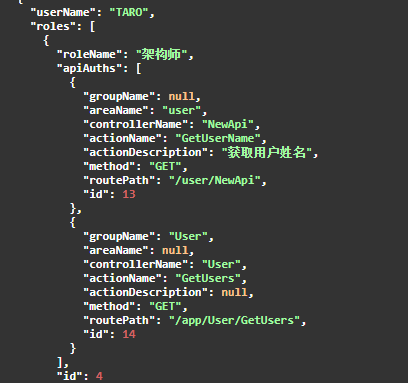

## 7. 第六步

再次改造获取用户信息，然后引入AceFramework的Jwt模块来进行权限的校验

### 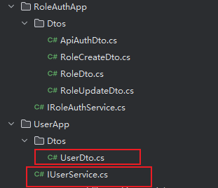

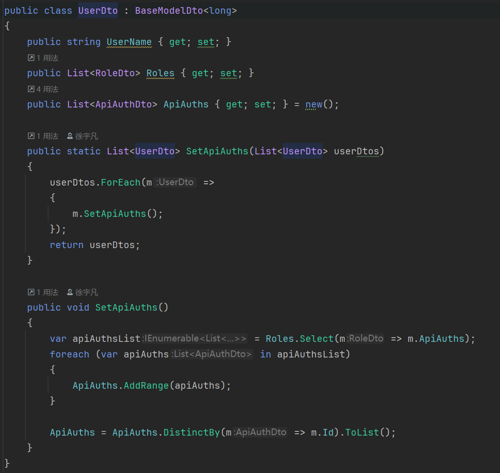

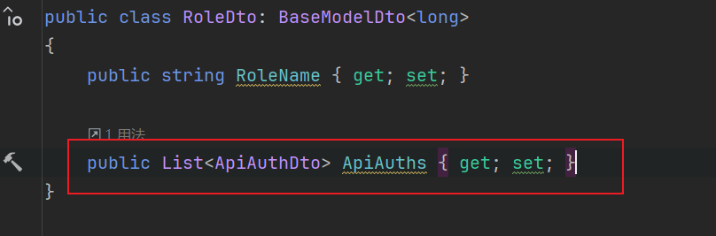

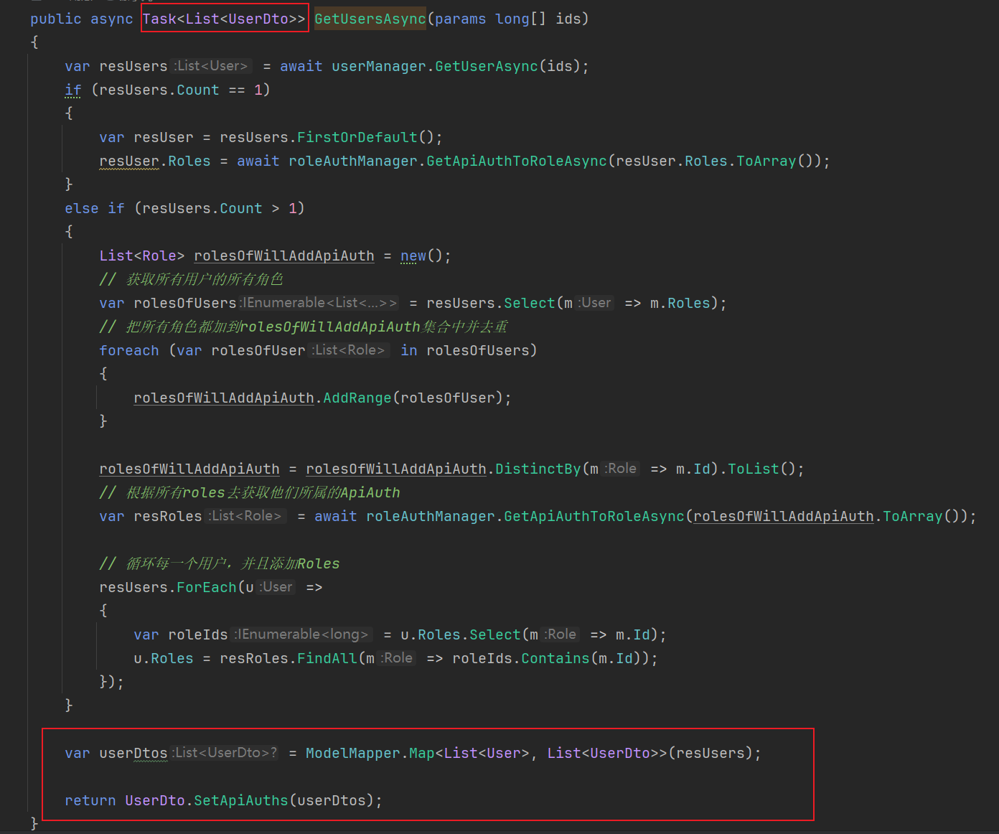

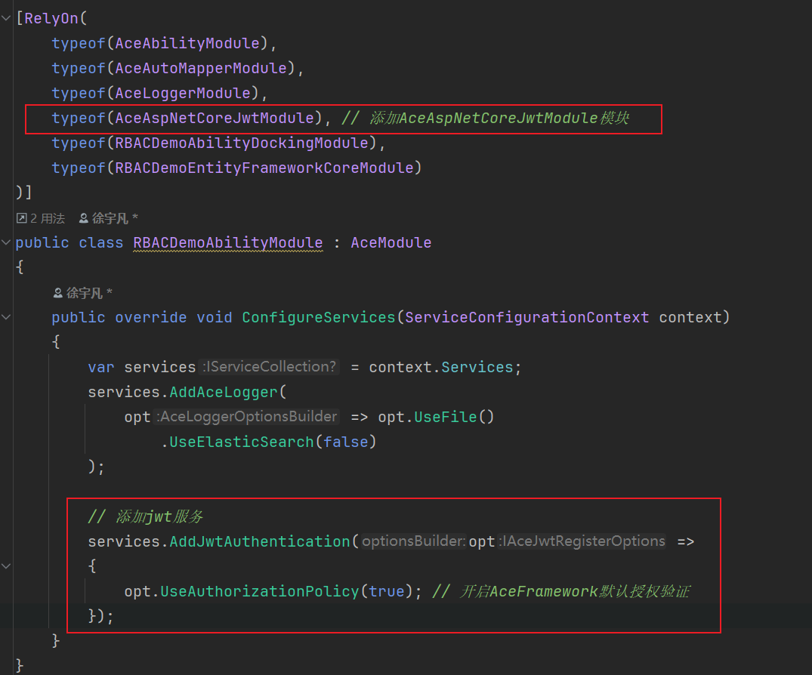

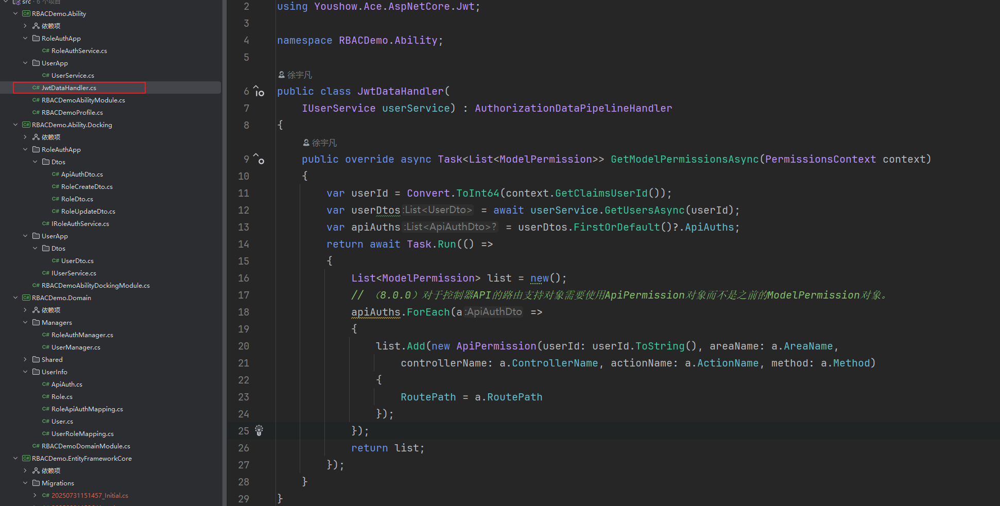

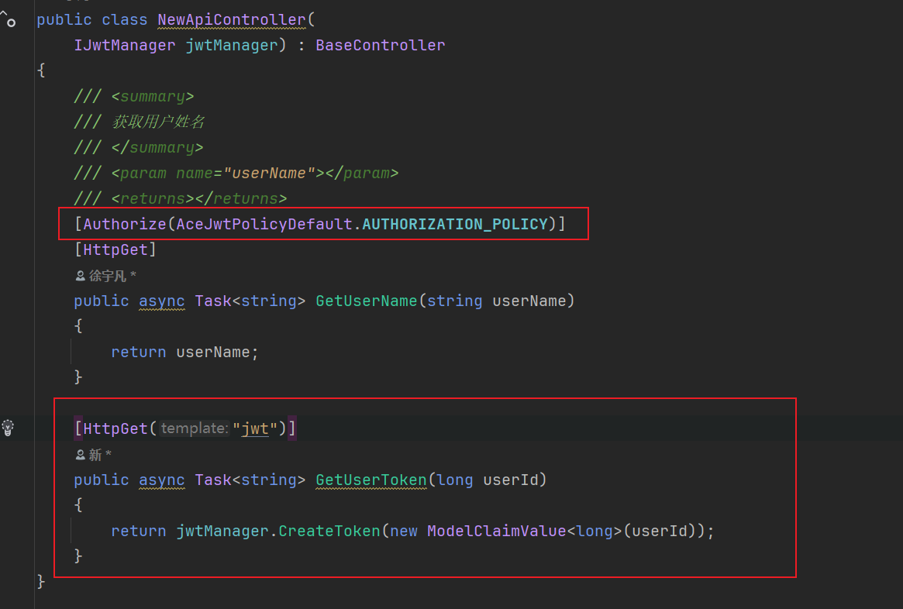
