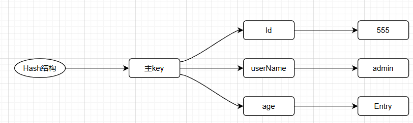

# Redis

## Redis是单线程的

## Redis五种数据类型

### String类型

- string类型是最基础的数据类型，是由一个Key和Value组成的
- string类型是二进制安全的类型，涉及到二进制基本上可以保存任何类型的数据，包括图片
- string类型的value最多可以保存512M数据

### Hash类型

- 键值对集合
- 是string类型的field和value的映射表，特别适合存储对象，但是有一个禁忌，即要求的字段value值必须是基础类型
- 相对于存储json序列化成的字符串更加节约性能

## Redis的实际使用

> 注意：在hash中没有更新一说，直接覆盖原有的key就可以了

> Redis可以加个数据存储在内存中，但有一个缺陷，只要Redis服务重启，那么之前存储的信息都会消失。
>
> 如何解决 =》 解决方案：将数据持久化