# 测试基础

## 测试分类

### 按生产阶段划分

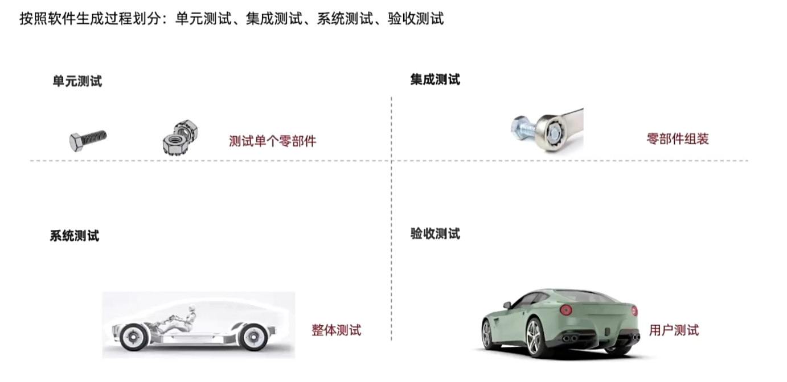

### 按代码可见度划分

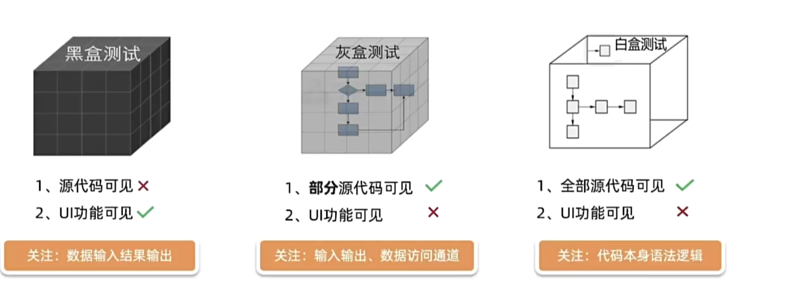

### 其他测试

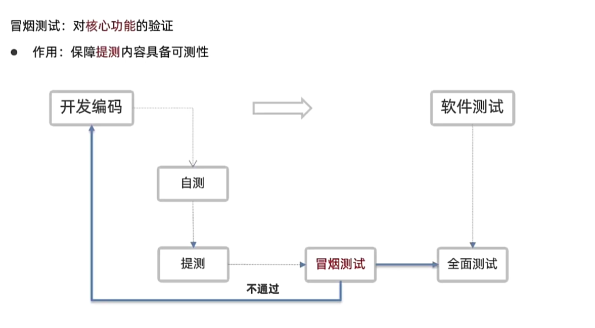

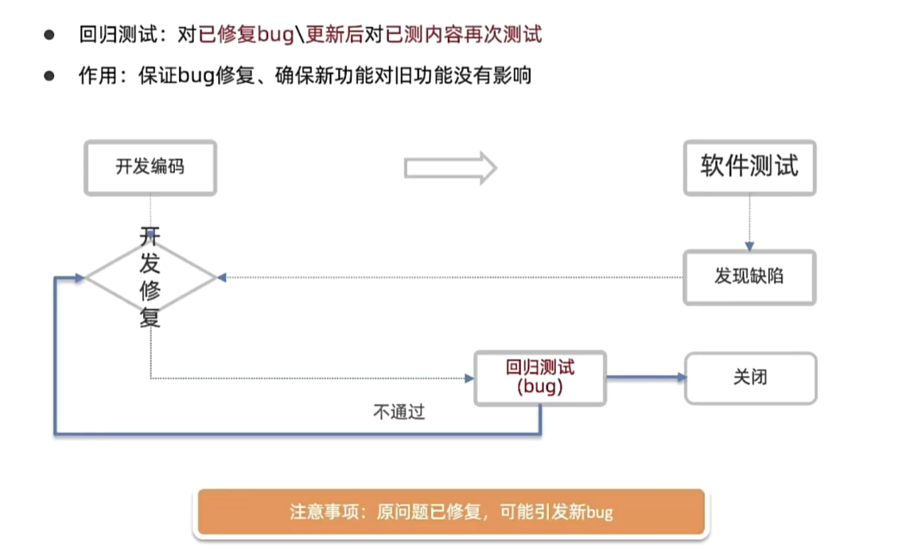

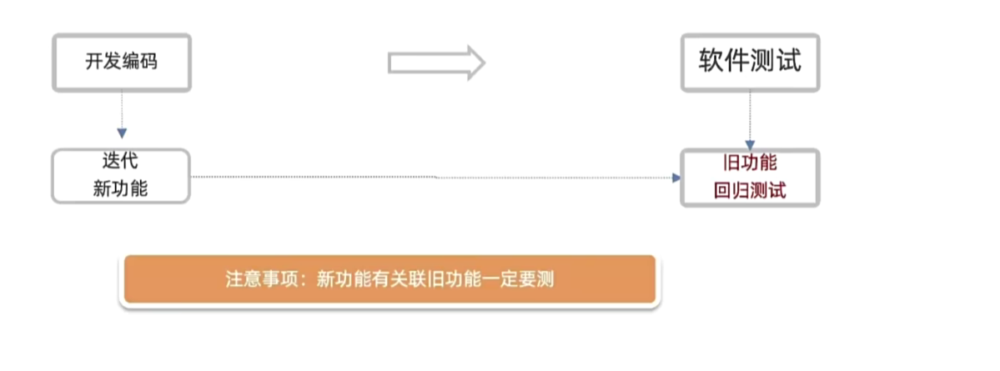

## 质量模型

衡量一个软件质量的维度

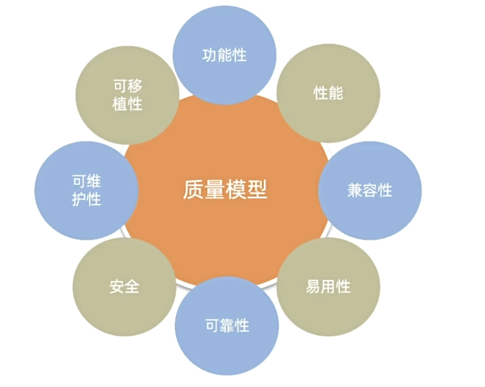

### 功能性

软件是否具备某方面的能力

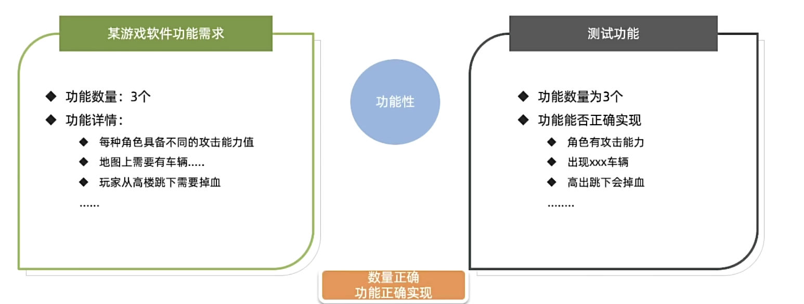

### 性能

多用户同时使用能否满足要求（时间、资源）

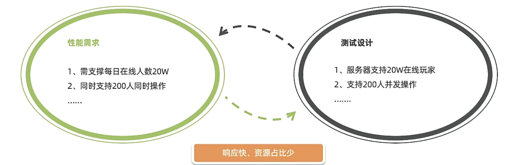

### 兼容性

在不同的设备/平台上能否正常使用

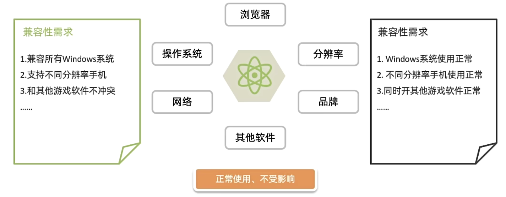

### 易用性

易学、易用、用户粘性好

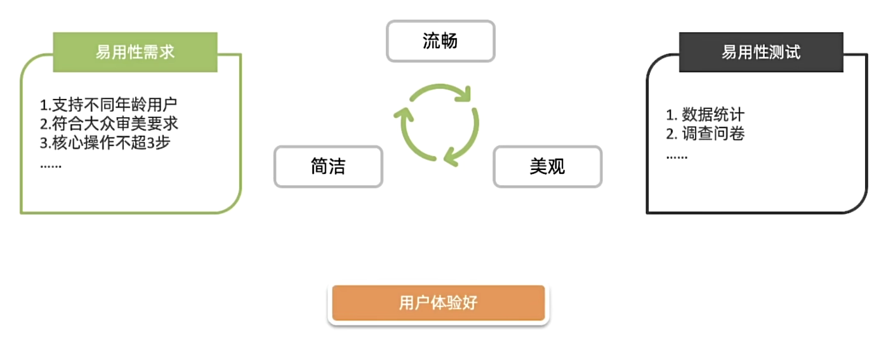

### 安全性

敏感数据存储/传输安全

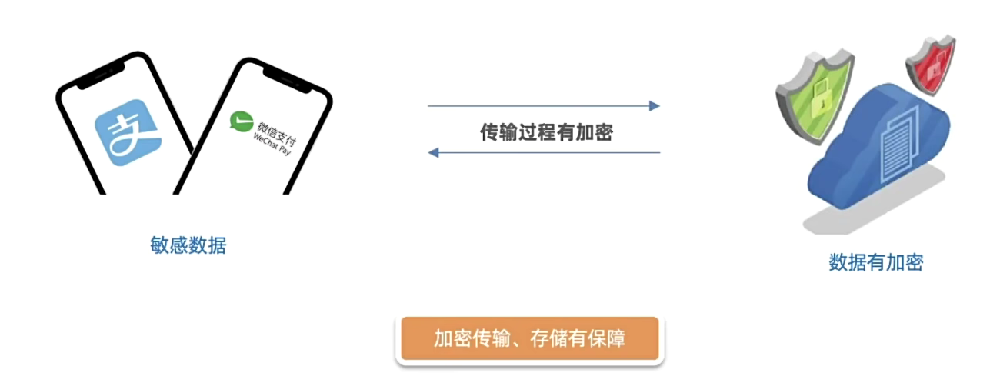

### 可靠性

长时间运行稳定，不出现异常

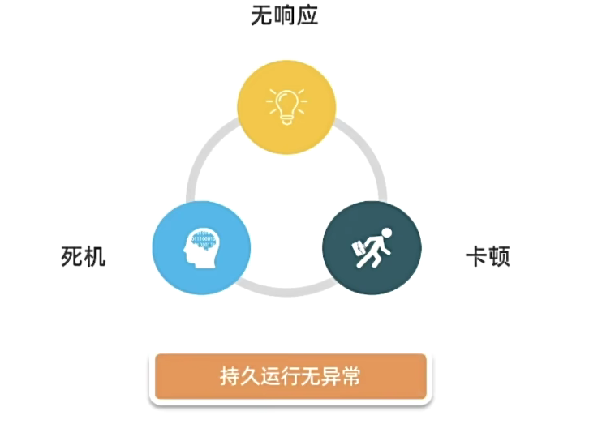

### 可移植性

应用系统升级/数据迁移方便

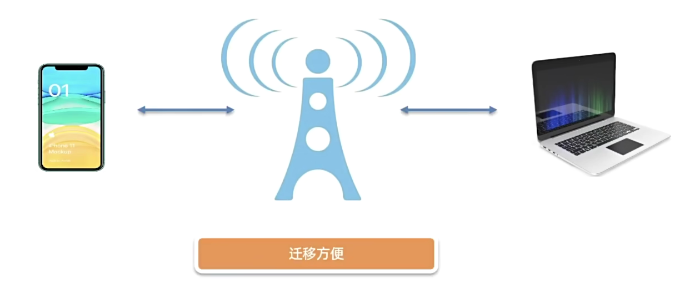

### 可维护性

运行过程出现问题维护操作是否方便

## 单功能测试

### 单功能

软件程序或应用程序只提供一项核心功能或特性，而不包含其他附加功能

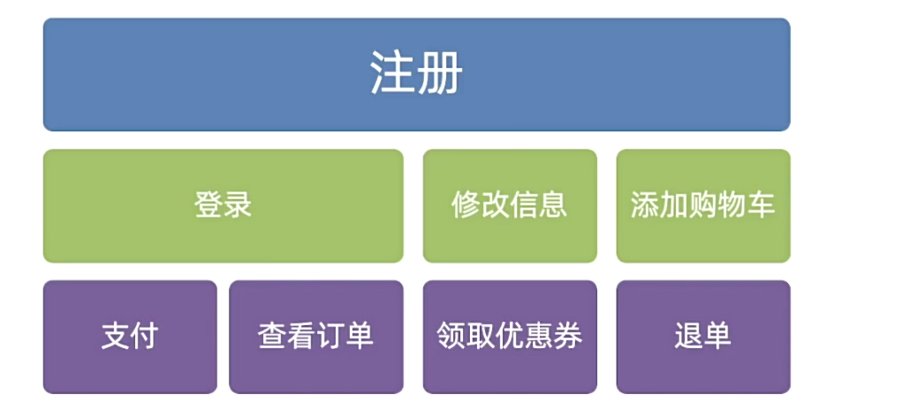

### 案例

#### 登录

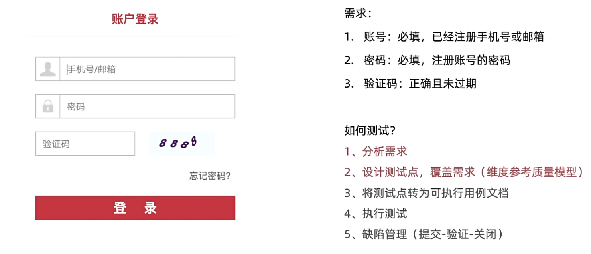

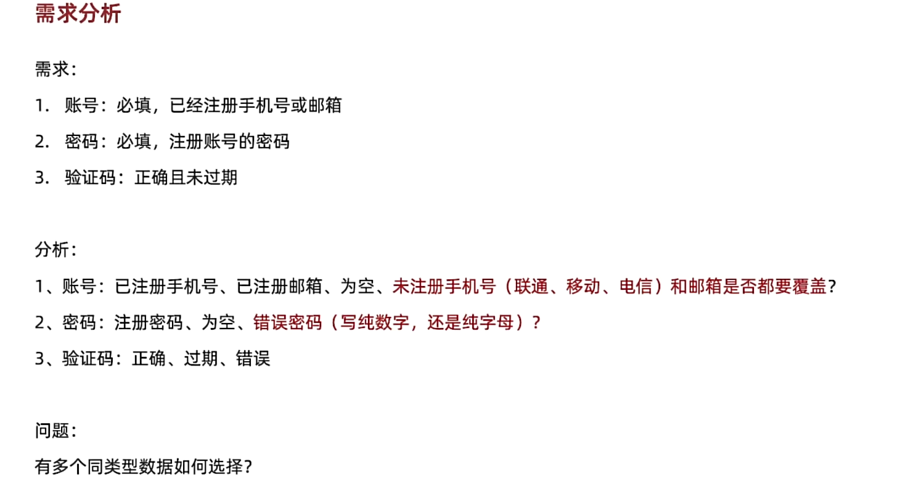

 [登录案列测试.xmind](xmind\登录案列测试.xmind) 

### 等价类划分法

一种用**少量数据**获得**较好测试效果**的工具

**场景：**表单类页面元素测试使用（输入框、下拉框、单选框、复选框）等

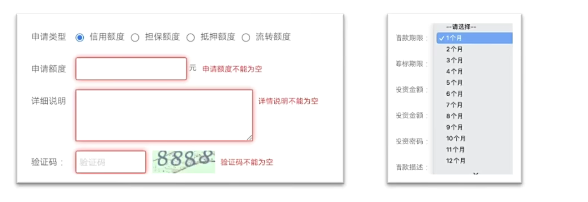

| 步骤：                                   | **需求：**                          |
| ---------------------------------------- | ----------------------------------- |
| 1、 划分有效等价类：满足需求的数据集合   | 已注册 13600001111 13600001112      |
| 2、 划分无效等价类：不满足需求的数据集合 | 未注册 13711110000 13788882222      |
| 3、 每类中选取代表数据                   | 有效：13600001111 无效：13711110000 |

**工具：**xmind或excel

### 边界值分析法

一个边界范围限制选取测试数据工具

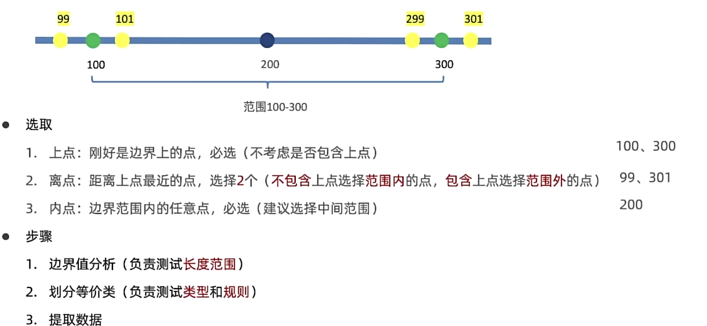
