# Vue3


## Vue指令

### v-html

本身与插值表达式（{{}}）类似，但是它所在的标签里面必须是空的，不能有值，而插值表达式没有这个限制

### v-bind

简写：就是：

场景1：

```vue
<input type="text" value="message">
```

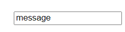

```vue
<input type="text" :value="message">
```

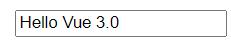

场景2：

```vue
<p v-html="htmlContent" :class="['pback', { 'pfore': isShowFore }]"></p>
<p class="pback pfore">说明：{{ message }}</p>
<button @click="OnChangeMessage">改变</button>
```

```vbscript
const isShowFore = ref(false);
const htmlContent = ref('Hello Vue 3.0');
const message = ref('Hello Vue 3.0');

const OnChangeMessage = () => {
	isShowFore.value = true;
}

return { message, isShowFore, htmlContent, OnChangeMessage }
```

```css
.pback {
  background-color: aqua;
}

.pfore {
  color: red;
}
```

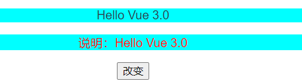

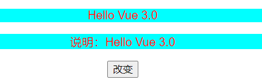

场景3：

```vue
<p v-html="htmlContent" :style=[styleShow1,styleShow2]></p>
```

```vbscript
const styleShow1 = ref({ color: 'red' });
const styleShow2 = ref({ backgroundColor: 'blue' });
```


### v-model

这个指令天然用于表单元素，它是一个双向绑定的指令

### v-show/v-if

* 二者都是在是否显示某些内容时使用，都是通过bool类型来操作

* 但v-show无论是否显示，都会渲染到页面中，只是通过css的特征值display控制其是否显示，一般用于保密性不高，且会频繁切换显示隐藏的内容
* v-if具有v-else-if和v-else的组合

```vue
<p v-show="isShowMessage">{{ message }}</p>
<p v-if="isShowMessage">{{ message }}</p>
<button @click="onShowMessage">显示/隐藏</button>
```

```vbscript
const isShowMessage = ref(false);

const onShowMessage = () => {
	isShowMessage.value = !isShowMessage.value;
}
```

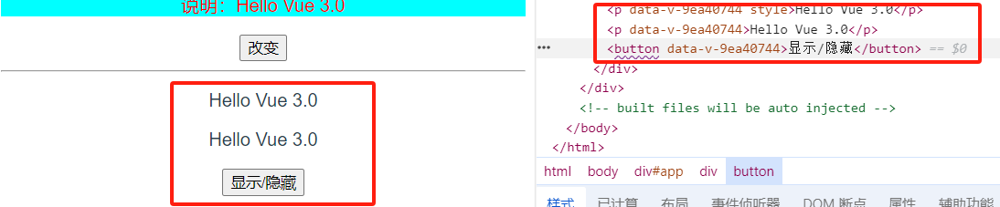

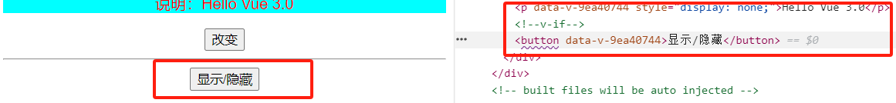

### v-for

这个指令用于循环数据，它可以循环普通的数组、对象数组、对象和数字

```vue
<p>
	<ul>
		<li v-for="user in myObjectArray" :key="user.id">
			<input type="checkbox">
			ID: {{ user.id }} / Name: {{ user.userName }} / Age: {{ user.age }}
		</li>
	</ul>
	<button @click="onAddData">添加数据</button>
</p>
```

```vbscript
const myObjectArray = ref([
	{ id: 1, userName: "zhangsan", age: 20 },
	{ id: 2, userName: "lisi", age: 15 },
	{ id: 3, userName: "wangwu", age: 52 }
]);

const onAddData = () => {
	// myObjectArray.value.push({ id: 4, userName: "zhaoliu", age: 30 });
	myObjectArray.value.unshift({ id: 4, userName: "zhaoliu", age: 30 });
}
```

> 注意：使用v-for时一定要记住使用其key属性，如果不指定其key属性，那么它会默认以索引来绑定。push是向下添加，可能不会出现bug；而unshift是向上添加，那么选中的复选框就会向上移一格

## vue3的组件引入

组件定义在`components`文件夹中，同样是`.vue`的文件，其实就可以得出组件即页面，页面即组件的道理

```vue
<template>
    <div>
        <h3>Hello This is MyComponent</h3>
    </div>
</template>

<script>
export default {
    setup() {


        return {}
    }
}
</script>

<style scoped></style>
```

```js
import MyComponent from '../components/MyComponent.vue'

export default defineComponent({
  components: {
    MyComponent
  },
})
```

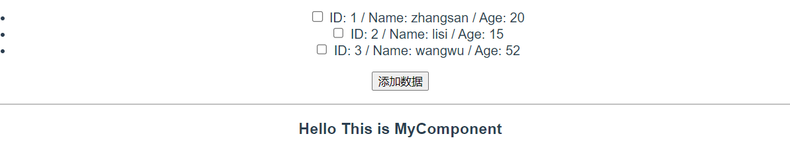

## setup函数下的父子传参

```vue
<template>
    <div>
        <h2>{{ props.msg }}</h2>
        <h3>Hello This is MyComponent</h3>
    </div>
</template>

<script>
export default {
    props: {
        msg: String
    },
    setup(props) {


        return { props }
    }
}
</script>

<style scoped></style>
```

```vue
<template>
  <div>
    <p>
    <ul>
      <li v-for="user in myObjectArray" :key="user.id">
        <input type="checkbox">
        ID: {{ user.id }} / Name: {{ user.userName }} / Age: {{ user.age }}
      </li>
    </ul>
    <button @click="onAddData">添加数据</button>
    </p>
    <hr>
    <MyComponent :msg="parentName"/>
  </div>
</template>

<script lang="ts">
import { defineComponent, ref } from 'vue'
import MyComponent from '../components/MyComponent.vue'

export default defineComponent({
  components: {
    MyComponent
  },
  setup() {

    const parentName = ref('这是HomeView页面');

    return {
      parentName
    }
  }
})
</script>

<style scoped></style>
```

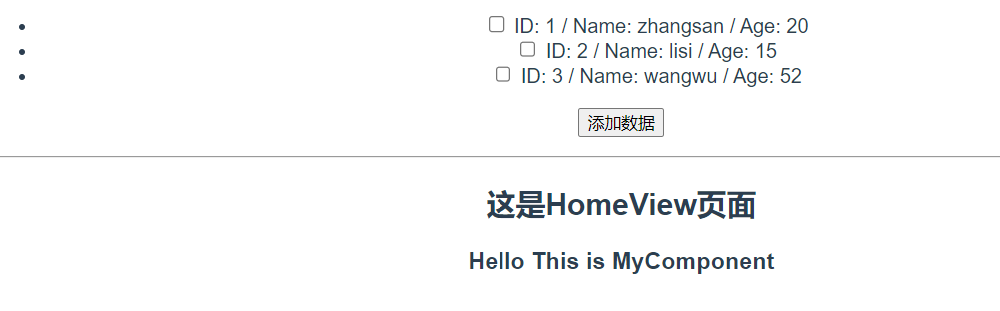

## setup函数下的子向父传参

```vue
<template>
    <div>
        <h2>{{ props.msg }}</h2>
        <h3>Hello This is MyComponent</h3>
        <button @click="onSendMsgToParent">传递值给父组件</button>
    </div>
</template>

<script>
export default {
    props: {
        msg: String
    },
    emits: ["postmsg"],
    setup(props, context) {
        const onSendMsgToParent = () => {
            context.emit("postmsg", "我是子组件要传递的参数");
        }

        return { props, onSendMsgToParent }
    }
}
</script>

<style scoped></style>
```

```vue
<template>
  <div>
    <MyComponent :msg="parentName" @postmsg="receiveChildMsg" />
  </div>
</template>

<script lang="ts">
import { defineComponent, ref } from 'vue'
import MyComponent from '../components/MyComponent.vue'

export default defineComponent({
  components: {
    MyComponent
  },
  setup() {

    const parentName = ref('这是HomeView页面');
    const receiveChildMsg = (data: string) => {
      htmlContent.value = data;
    }

    return {
      parentName,
      receiveChildMsg
    }
  }
})
</script>

<style scoped></style>
```

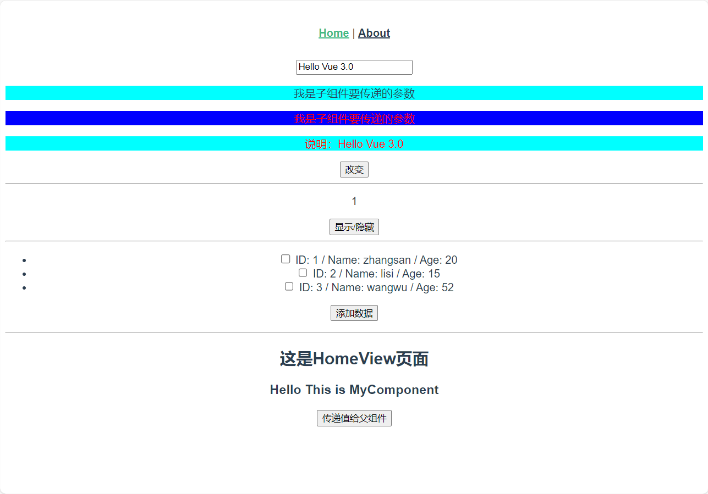

## 组件插槽

在不改变子组件的前提下，给父组件中子组件区域加上想要的内容

### 默认插槽

在子组件加入`<slot></slot>`标签，然后在父组件的子组件标签中写想要的样式

```vue
<MyComponent :msg="parentName" @postmsg="receiveChildMsg">
      <ul>
        <li v-for="user in myObjectArray" :key="user.id">
          <input type="checkbox">
          ID: {{ user.id }} / Name: {{ user.userName }} / Age: {{ user.age }}
        </li>
      </ul>
</MyComponent>
```

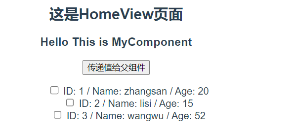

### 具名插槽

为插槽命名

```vue
<template>
    <div>
        <h3>header</h3>
        <slot name="header"></slot>
        <hr>
        <h3>default</h3>
        <slot></slot>
        <hr>
        <h3>footer</h3>
        <slot name="footer"></slot>
    </div>
</template>
```

```vue
    <MyComponent :msg="parentName" @postmsg="receiveChildMsg">
      <template v-slot:header>
        this is header slot
      </template>
      <template #default>
        this is default slot
      </template>
      <template #footer>
        this is footer slot
      </template>
    </MyComponent>
```

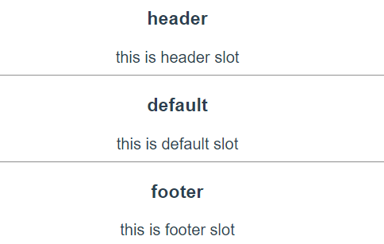

### 动态插槽

就是让父组件接收插槽名称变成一个变量，让其能被调控

```vue
<template>
    <div>
        <h3 v-if="$slots.header">header</h3>
        <slot name="header"></slot>
        <hr>
        <h3>default</h3>
        <slot></slot>
        <hr>
        <h3 v-if="$slots.footer">footer</h3>
        <slot name="footer"></slot>
    </div>
</template>
```

```vue
    <MyComponent :msg="parentName" @postmsg="receiveChildMsg">
      <template v-slot:[slotName]>
        this is {{ slotName }} slot
      </template>
      <template #default>
        this is default slot
      </template>
    </MyComponent>
    <button @click="onChangeSolt">切换插槽</button>
```

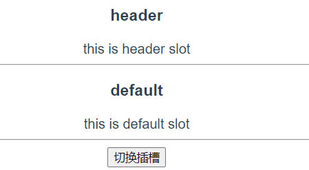

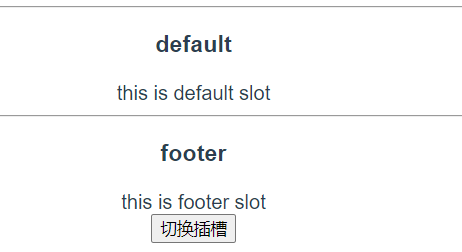

### 条件插槽

就是`v-if`的使用，在动态插槽中也进行了使用`<h3 v-if="$slots.header">header</h3>`

### 作用域插槽

将子组件中的数据传给父组件使用

```vue
<template>
    <div>
        <h3>default</h3>
        <slot :text="defaultSoltText" number="123"></slot>
    </div>
</template>
```

```vue
    <MyComponent :msg="parentName" @postmsg="receiveChildMsg" v-slot="soltData">
      {{ soltData.text }}
      {{ soltData.number }}
    </MyComponent>
```


### 具名作用域插槽

同上，只是划分了一下而已

```vue
<template>
    <div>
        <h3 v-if="$slots.header">header</h3>
        <slot name="header" text="我是header插槽内容"></slot>
        <hr>
        <h3>default</h3>
        <slot :text="defaultSoltText" number="123"></slot>
    </div>
</template>
```

```vue
    <MyComponent :msg="parentName" @postmsg="receiveChildMsg">
      <template v-slot:[slotName]="soltData">
        this is {{ slotName }} slot
        {{ soltData.text }}
      </template>
      <template #default="soltData">
        this is default slot
        {{ soltData.text }}
        {{ soltData.number }}
      </template>
    </MyComponent>
```

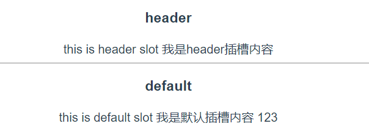

## reactive的使用

```vue
    {{ reactiveData1 }}
    <br>
    {{ reactiveData2 }}
    <br>
    <button @click="onChangeReactiveData1">改变</button>
```

```vbscript
    const myReactiveData = reactive({
      reactiveData1: 'this is reactiveData1',
      reactiveData2: 'this is reactiveData2',
      onChangeReactiveData1: () => {
        myReactiveData.reactiveData1 = 'reactiveData1'
      }
    });
    const reactiveDataRefs=toRefs(myReactiveData);

return {
      ...reactiveDataRefs
    }
```

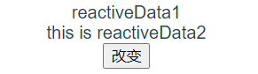

## Vue3生命周期

创建阶段：`setup`

挂载阶段：`onBeforeMount`、`onMounted`

更新阶段：`onBeforeUpdate`、`onUpdated`

销毁阶段：`onBeforeUnmount`、`onUnmounted`
